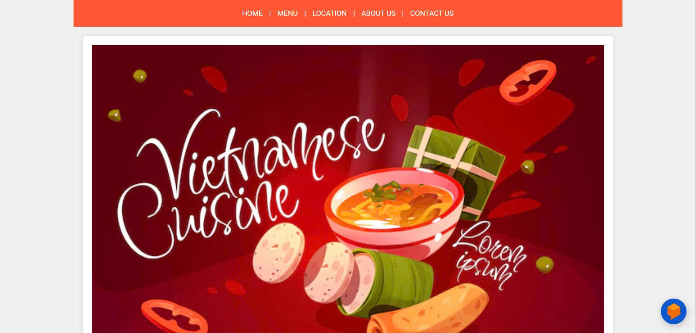
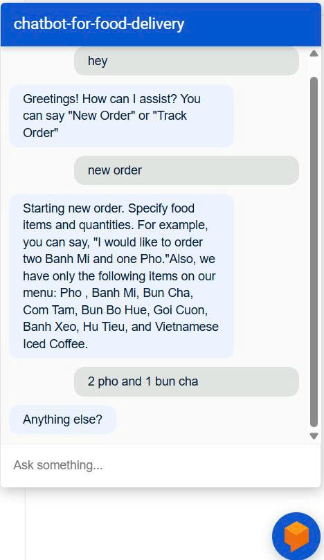

# 🍜 Chatbot Food Delivery (Vietnamese Cuisine)

### 💬 Web


### 🍱 Sample Menu


### 💬 Chat Demo


A conversational AI chatbot for Vietnamese food ordering — built using **Dialogflow ES**, **FastAPI**, and **MySQL**.  
The bot can take new orders, modify existing ones, and track delivery status in real time.

---

## 🚀 Features

- 💬 Natural conversation flow using **Dialogflow ES**
- 🍽️ Handles intents like:
  - `new.order` – start a new food order
  - `order.add` – add menu items with quantity
  - `order.remove` – remove items from order
  - `order.complete` – finalize the order
  - `track.order` – track existing orders
- 🧠 Webhook fulfillment with **FastAPI**
- 🗄️ Menu and orders stored in **MySQL**
- 🇻🇳 Adapted for **Vietnamese dishes** and prices

---
## ⚙️ Installation & Setup

### 1️⃣ Clone the Repository
```bash
git clone https://github.com/<your-username>/Chatbot_Food_Delivery.git
cd Chatbot_Food_Delivery
```

### 2️⃣ Install Dependencies
```bash
pip install -r requirements.txt
```

### 3️⃣ Import Database
Use MySQL Workbench or CLI to import:
```bash
source pandeyji_eatery_vietnamese.sql;
```

### 4️⃣ Run FastAPI Server
```bash
uvicorn main:app --reload
```
Server will start at:  
👉 `http://127.0.0.1:8000`

### 5️⃣ (Optional) Connect to Dialogflow
- Login and set your auth token
```bash
ngrok config add-authtoken <your_auth_token>
ngrok http 8000
```
- Go to [Dialogflow Console](https://dialogflow.cloud.google.com)
- Create an **agent**
- Enable **Fulfillment webhook**
- Set the webhook URL:
  ```
  https://<your-ngrok-url>/webhook
  ```
- Enable **Webhook Call** for each intent.

---

## 🧱 Technologies Used

| Component | Technology |
|------------|-------------|
| Backend | FastAPI (Python) |
| Database | MySQL |
| AI Engine | Dialogflow ES |
| Frontend | HTML, CSS, JS |
| Tunneling | Ngrok |
